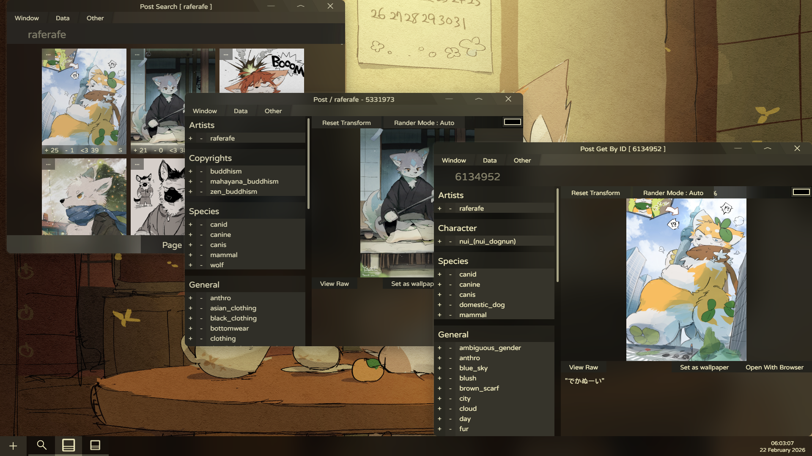
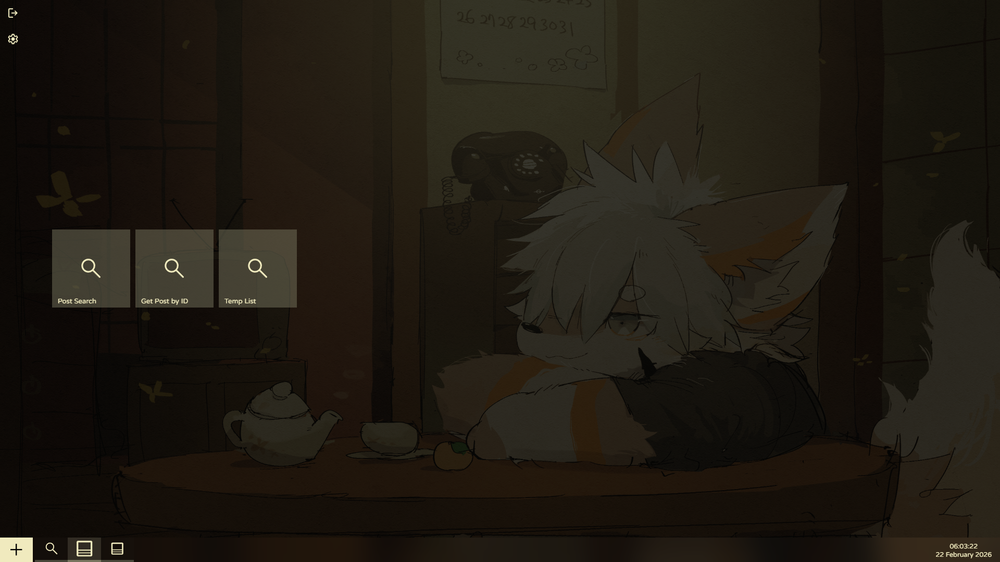
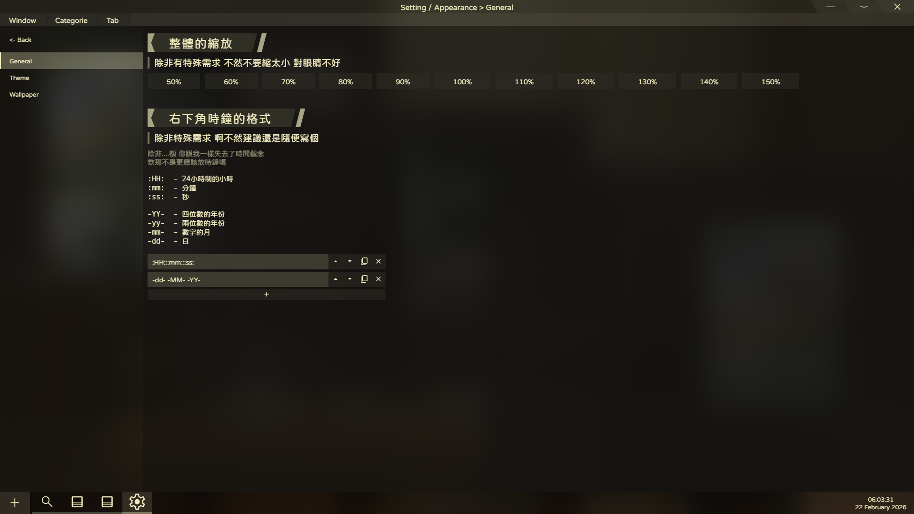
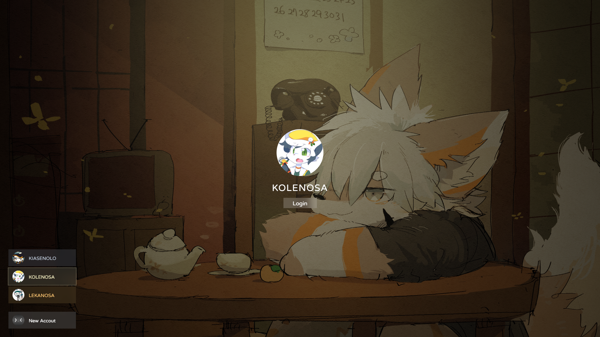

# 我要先講
這東西：  
動畫很多 也很卡  
效能優化很抽象  
沒辦法篩選分級 只能自己 rating:s  
沒有候選 ( Suggestion )  
甚至之後可能會不小心刪掉所有資料 或者是資料結構發生改變  
請斟酌使用 不要過度依賴  

然後這東西有很多bug  
然後有bug要講 我盡可能修  
如果 有更好的體驗建議可以跟我講  
我不一定會采納 但一定會看  
可以丟issues 這樣我就看到了  
你也可以丟pr 但 我....可能會花很多時間去消化就是了  

# 概念
這個是 全視窗化的E621 App 所以跟傳統意義上的E621 App 會有很大的區別  
啊因爲是全視窗化 所以會顛覆掉很多邏輯 需要自己重新去熟悉  
但是 熟了之後應該會蠻好玩的  
然後下面是一些截圖 你可以自己看看 

  
  
  
  

桌布是raferafe的 他畫的很好看  
https://www.pixiv.net/users/53255280  
頭貼是Yonkagor畫的 他做的音樂很好聼  
https://x.com/YonKaGor  
https://www.youtube.com/@YonKaGor  

哦 [I Still Create](https://www.youtube.com/watch?v=84F_UdwTcAg) 很好聼 去聽 然後MV很帥

對了 預設是沒任何賬號的 上面的演示圖是 我作品集裏面的版本  

# 已知問題
Shift + Tab 十分不好用 甚至等於不能用  
因爲東西都用LocalStorage存 所以東西一多 會拖慢很多速度  
沒有自動登錄的選項 預設都是開著的  
postSearch的按鈕只能拖 暫時不能按（emm....雖然在postGetById裏面 你真的只能拖）  
中英文混在一起 抽象  
建好賬號不會自己登錄  
## 甚至有些東西還沒做
設定裏面很空  
賬號改不了密碼  
沒有pool  
沒下載隊列  
賬號不能換頭貼  
## 其他的東西
有時候 視窗還原不回來怎麽辦？  
那就右鍵圖示 點Reset Rect 然後隨便一個size 就可以了  
然後Reload十分不好用 甚至不能用  

Alt Tab切出去再切回來 視窗不能互動 怎麽辦  
按一下Alt 鬆開 就沒事了  
因爲 他抓不到Alt鬆開的event  

# 如何讓他在我電腦上面跑起來
先把專案下載下來 然後呢？ 去裝Node.js  
然後在專案根目錄 開終端 `npm i` 裝個套件    
然後 接下來 就看你 如果你想寫 或者玩一下 那就 `npm run dev`  
如果你想直接跑 那 就 `npm run build` 跑好了之後就 `npm start`  
東西會開在 http://127.0.0.1:1069/ ( 十分好Port )

# 跟各位想幫我寫的人講一下
我的專案資料結構會很奇怪  
（ 因爲這東西是從我作品集裏面拆出來的 ）
而且東西都寫在同個檔案  
所以會很痛苦  
抱歉 但 我現在暫時不想改掉這個習慣  
然後還有 我的css會用到一些你可能沒有看到的字體
是正常的 因爲在我原本的作品集裏面 確實會用到 而且也是存在的